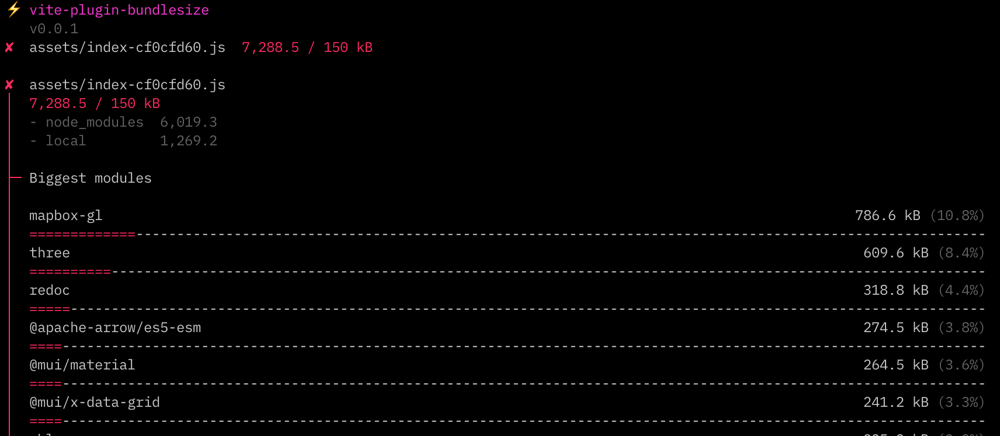

# ⚡ vite-plugin-bundlesize

Vite plugin for inspecting bundlesizes and enforcing limits on the amount of JS shipped to the client. Works with Vite, Astro, SvelteKit, and any other Vite-based build tool.

Inspired by [webpack-bundle-analyzer](https://github.com/webpack-contrib/webpack-bundle-analyzer) and [Bundlephobia](https://bundlephobia.com/).

⚠️ Status: **alpha**. Sizes shown may not be accurate!



## Setup

### Requirements

- **Vite 4.x**. For most users on 3.x this should be a painless upgrade.
- `"type": "module"` enabled in your project’s `package.json` ([docs](https://nodejs.org/api/packages.html#type))

### Installing

Install from npm:

```
npm install --dev vite-plugin-bundlesize
```

### Config

And add to your [Vite config plugins](https://vitejs.dev/config/shared-options.html#plugins). Also be sure to enable [sourcemaps](https://vitejs.dev/config/build-options.html#build-sourcemap) as this is needed to calculate the sizes more accurately (setting it to `hidden` is recommended):

```diff
  import { defineConfig } from 'vite';
+ import bundlesize from 'vite-plugin-bundlesize';

  export default defineConfig({
    plugins: [
+     bundlesize(),
    ],
+   build: {
+     sourcemap: 'hidden',
+   },
  });
```

Now whenever you run `npx vite build`, a `bundlemeta.json` file will be created. It’s recommended to add this to `.gitignore` as most people don’t need to track this. This is created only so you can inspect your bundle without having to do a fresh build each time.

### Visualizing your bundle

Make sure you’ve built your project first (`vite build`). Then, inspect your bundle composition by running the following command from the project root:

```
npx bundlesize
```

This will reuse the existing data saved to `bundlemeta.json` from the last build. If your code has changed at all, you’ll need to rerun `vite build` to regenerate that.

### Enforcing size limits

Add a `limits` option to enforce limits on entry files:

```diff
  import { defineConfig } from 'vite';
  import bundlesize from 'vite-plugin-bundlesize';

  export default defineConfig({
    plugins: [
-     bundlesize(),
+     bundlesize({
+       limits: [
+         {name: 'assets/index-*.js', limit: '100 kB'},
+         {name: '**/*',       limit: '150 kB'},
+       ],
+     }),
    ],
  });
```

- The `name` field is a glob matched by [picomatch](https://github.com/micromatch/picomatch).
- The `limit` field can be any human-readable size. We recommend `150 kB` which is the default, but you may raise or lower that number as needed.
- The order of the array matters. Only the first `name` a file matches with will apply, so order your matches from more-specific to less-specific.

Note that **only entry files are checked.** vite-plugin-bundlesize won’t measure lazy-loaded code because that is not render blocking. Ideally this helps you focus on only meaningful metrics in regards to bundle sizes.

#### Ignoring chunks

To ignore a chunk, set `limit: Infinity`:

```diff
  import { defineConfig } from 'vite';
  import bundlesize from 'vite-plugin-bundlesize';

  export default defineConfig({
    plugins: [
      bundlesize({
        limits: [
          {name: 'index.*.js',   limit: '100 kB'},
+         {name: 'ignored.*.js', limit: Infinity},
          {name: '**/*',         limit: '150 kB'},
        ],
      }),
```

#### Exiting build

By default, this plugin will **cause `vite build` to error and exit** when a chunk exceeds a certain limit (as opposed to [build.chunkSizeWarningLimit](https://vitejs.dev/config/build-options.html#build-chunksizewarninglimit) which will only warn). In order to allow every build to pass and only show warnings, add `allowFail: true`:

```diff
  import { defineConfig } from 'vite';
  import bundlesize from 'vite-plugin-bundlesize';

  export default defineConfig({
    plugins: [
      bundlesize({
+       allowFail: true,
      }),
    ],
  });
```

If `allowFail: true` is set, you’ll have to run `npx bundlesize` after every build to throw an error (including in CI).

## All options

| Name         |         Type         | Description                                                                        |
| :----------- | :------------------: | :--------------------------------------------------------------------------------- |
| `outputFile` |       `string`       | Change the location/name of `bundlemeta.json`                                      |
| `limits`     |      `Limit[]`       | See [enforcing size limits](#enforcing-size-limits)                                |
| `allowFail`  |      `boolean`       | Allow `vite build` to succeed even if limits are exceeded ([docs](#exiting-build)) |
| `stats`      | `'summary' \| 'all'` | Show a **summary** of failed chunks (default), or view **all** stats.              |

## Troubleshooting

### Error `[ERR_REQUIRE_ESM]`

If you get the following error add `"type": "module"` to your top-level `package.json` ([docs](https://nodejs.org/api/packages.html#type)). For most users using Vite this won’t have any impact (and is recommended to do anyway).

```
Error [ERR_REQUIRE_ESM]: require() of ES Module /…/vite-plugin-bundlesize/dist/plugin/index.js from /…/vite-plugin-bundlesize/example/vite-react/vite.config.ts not supported.
Instead change the require of index.js in /…/vite-plugin-bundlesize/example/vite-react/vite.config.ts to a dynamic import() which is available in all CommonJS modules.
```
